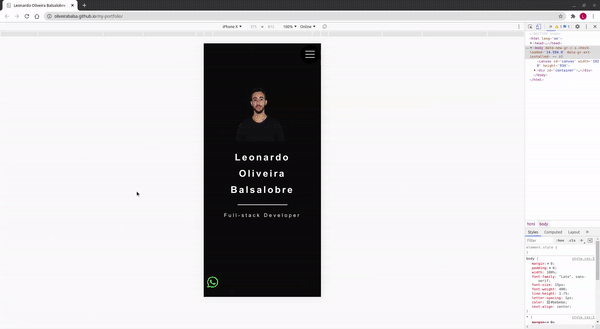

	<h1 align="center">My Portfolio :older_man: :tm:</h1>

  <a href="#-Technologies">Technologies</a>&nbsp;&nbsp;&nbsp;|&nbsp;&nbsp;&nbsp;
  <a href="#-Project">Project</a>&nbsp;&nbsp;&nbsp;|&nbsp;&nbsp;&nbsp;
  <a href="#-How-to-contribute">How to contribute</a>&nbsp;&nbsp;&nbsp;|&nbsp;&nbsp;&nbsp;
  <a href="#memo-license">License</a>

 

  

 

## :heavy_check_mark: :computer: :arrow_right: Web Result

<h1 align="center">
    
</h1>

## :heavy_check_mark: :computer: :arrow_right: Mobile Result

<h1 align="center">
    
</h1>

## 🚀 Technologies

This project was developed with the following technologies:

- [HTML5](https://www.w3schools.com/html/)
- [CSS](https://www.w3schools.com/css/)
- [Javascript](https://developer.mozilla.org/en-US/docs/Web/JavaScript)

## 💻 Project

This is ***My Portfolio***, is a Project that **use the HTML5, CSS and Javascript**. For long time ago, I don't use this technologies without framework, so I decided to make this for training purposes. Made with **HTML5**, **CSS**, **JavaScript**.

## 🤔 How to contribute

- Make a fork;
- Create a branch with your feature: `git checkout -b my-feature`;
- Do commit with your changes: `git commit -m 'feat: My new feature'`;
- Do a push for your branch: `git push origin my-feature`.

After the merge of your pull request was made, you can delete your branch.

## :memo: License

This project is under License MIT. See the documentation [LICENSE](LICENSE) for more details.

---

Developed by <a href="https://www.linkedin.com/in/leonardo-balsalobre/">Leonardo Balsalobre</a> :copyright: